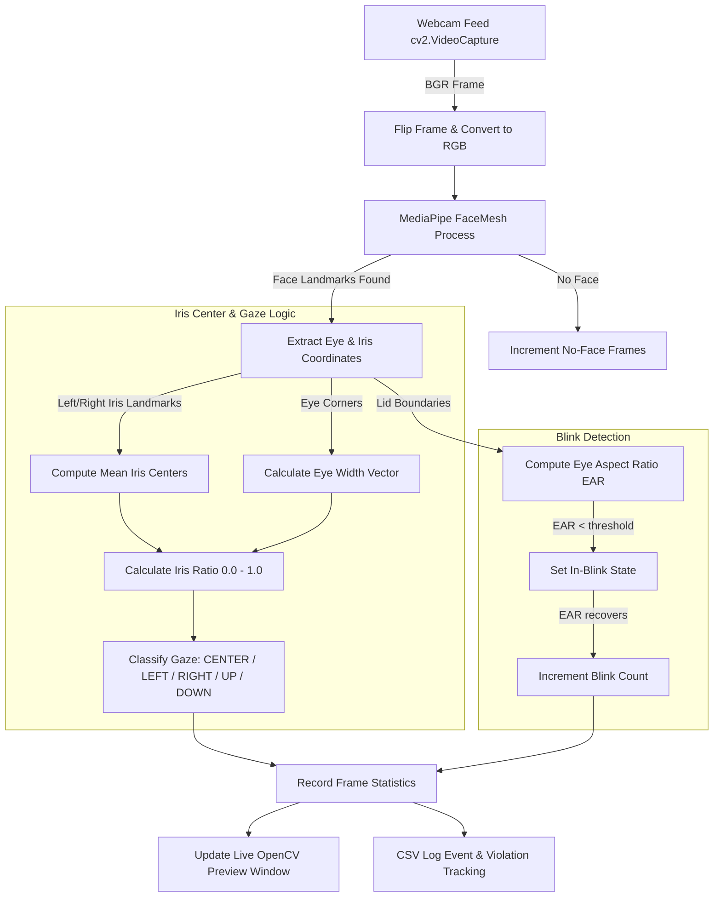
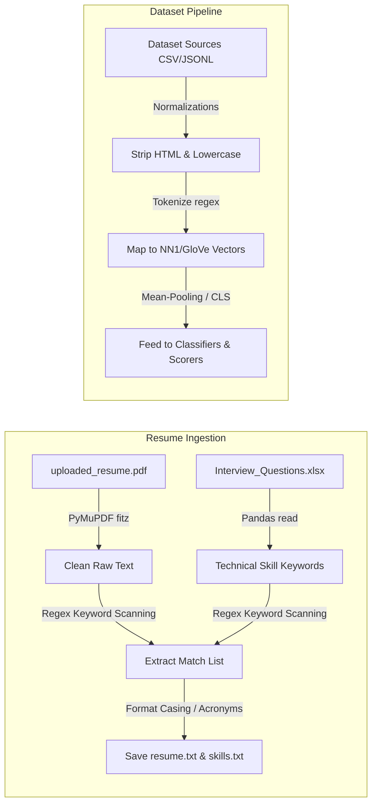
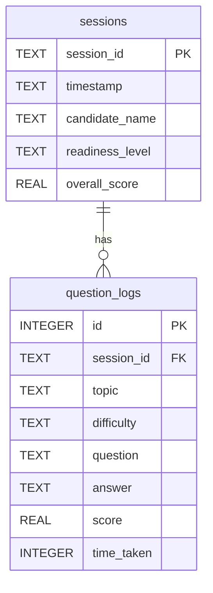

# AI Mock Interviewer (V1 & V2) — Comprehensive Codebase Audit & Architectural Analysis

Welcome to the comprehensive codebase audit and analysis report of the **AI Mock Interviewer** project. This document provides a highly detailed mapping of the platform's multi-modal system architecture, underlying neural network models (from custom NumPy skip-grams to fine-tuned transformer stacks and reinforcement learning policies), camera-based computer vision proctoring mechanics, data pre-processing flows, database schemas, and overall software engineering patterns.

---

## 1. Executive Summary & Project Evolution

The **AI Mock Interviewer** is a locally hosted, offline-first technical interview simulator. It bypasses expensive third-party LLM APIs by orchestrating a pipeline of specialized, lightweight deep learning models. The system evaluates a candidate's resume, assigns a targeted list of topics, ranks and presents difficulty-weighted questions, grades candidate answers in real-time, intervenes with generative follow-ups, tracks camera gaze/blink patterns for exam integrity, and logs detailed readiness assessments.

The platform is designed to be **strictly backward-compatible** and **modular**, transitioning seamlessly from the V1 static baseline to the V2 deep neural stack:

```mermaid
graph TD
    subgraph Presentation Layer
        A[Flask SPA Web App]
        B[Streamlit V2 Portal]
        C[CLI rich Interface]
    end

    subgraph Core Orchestration
        D[InterviewController]
        E[SessionState]
    end

    subgraph Model & Inference Layer
        F[NN1 Word Embeddings / GloVe Fallback]
        G[NN2 Topic Classifier]
        H[NN3 GRU Question Ranker]
        I[NN4 Siamese / DistilBERT Answer Scorer]
        J[GPT-2 Causal LM Follow-up Gen]
        K[REINFORCE RL Policy Topic Selector]
    end

    subgraph Data & Persistence
        L[PyMuPDF Resume Parser]
        M[SQLite session_db.py]
        N[REPORTS session_*.txt / stats.md]
    end

    subgraph Integrity & CV
        O[browser face-api.js Gaze]
        P[exam_proctor.py CV Daemon]
    end

    Presentation Layer -->|API Calls / State| Core Orchestration
    Core Orchestration -->|Manage State| E
    Core Orchestration -->|Invoke Lazily| Model & Inference Layer
    Core Orchestration -->|Extract Skills| L
    Core Orchestration -->|Persist Logs| M
    Core Orchestration -->|Export Reports| N
    Presentation Layer -.->|Absence Counts| O
    O -->|POST /api/proctor/report| Presentation Layer
    P -.->|Isolated Headless Gaze| Core Orchestration
```

---

## 2. Decoupled Multi-Tier System Architecture

The project is structured with a clean separation of concerns, decoupling the presentation layer from the core state machine, background vision proctoring, and database logging:

### A. Presentation Layer (Three Alternative UIs)
1. **Flask REST API & Single-Page Application (SPA) (`run.py` & `frontend/`)**: 
   A high-end, visual-heavy UI adopting a dark-mode **glassmorphism** design theme with background blur blobs, interactive progress bars, and floating components. Communication with the Flask server is entirely asynchronous via REST endpoints.
2. **Streamlit Alternative Frontend (`app_streamlit.py`)**: 
   A rapid-prototyping dashboard that maps all backend features into a single page. It introduces live metric displays (`st.metric`) for per-topic scoring, a progress tracker, a countdown timer, and in-memory override controls for all V2 model feature flags.
3. **Command Line Interface (CLI) (`main.py`)**: 
   A lean, fast terminal terminal client built using the `rich` console package. It handles timed console input, displays live progress panels, and supports specialized terminal commands such as `[skip]` and `[quit]`.

### B. Controller & State Orchestrator (`interview/controller.py` & `interview/session.py`)
* The `InterviewController` is the core execution brain of the platform. It dynamically handles resume ingestion, tracks session transitions, calls model inferences, runs adaptive difficulty heuristics, manages GPT-2 interventions, and compiles reports.
* The state is encapsulated in `SessionState`, keeping the session state tracker detached from the scoring and layout engines, making the controllers stateless between Streamlit rerenders or Flask request threads.

### C. Persistent Database & Report Logging (`data/session_db.py` & `interview/report.py`)
* An automated, zero-configuration SQLite manager (`sessions.db`) stores completed runs.
* Final evaluations compile running metrics into readable reports alongside exam-integrity statements, saving markdown metrics inside `reports/` and logging readiness badges into the database.

---

## 3. Deep Learning & Reinforcement Learning Model Pipeline

The platform runs a sophisticated ensemble of specialized neural networks, which can be toggled on/off additively via configuration feature flags:

| Model ID | Component Name | Architecture | Dimensions / Parameters | Primary Function | V1 Baseline | V2 Upgrade |
|:---:|---|---|---|---|---|---|
| **NN1** | **Word Embeddings** | Custom Skip-Gram Word2Vec (NumPy) | 64-dim vectors (custom corpus) | Semantic token vector representations | CPU trained custom embeddings | Native `GloVe 6B.100d` fallback with O(1) in-memory loading |
| **NN2** | **Topic Classifier** | PyTorch Feedforward Neural Net (MLP) | Linear (Input → 128) → ReLU → Linear (128 → 6) → LogSoftmax | Predicts candidate tech topic mappings from resume context | Standard custom Skip-Gram embeddings | 100-dim GloVe-projected vectors with **84.67% accuracy** |
| **NN3** | **Question Ranker** | PyTorch Gated Recurrent Unit (GRU) | GRU(Input, 64) → Linear(GRU + Cand + Diff → 1) → Sigmoid | Dynamic context-aware question selector from bank | Vanilla recurrent inputs | **Difficulty-aware GRU** factoring sequence context and past performance |
| **NN4** | **Answer Scorer** | Siamese Neural Net / Transformer MLP | Siamese projections + MLP (128 → 64 → 1) with 30% Dropout | Objective semantic similarity scoring between answer and reference | Mean-pooled Word2Vec Siamese network | Contextual **DistilBERT [CLS] token** (768-dim) encoder |
| **GPT-2** | **Follow-up Gen** | HuggingFace Causal Language Model | GPT-2 Small (124M params), linear-probed | Generative follow-up question generator | *None (Default question bank)* | Finetuned LM Head triggered on marginal scoring |
| **RL** | **Topic Policy** | Policy Gradient (REINFORCE) MLP | Linear(14 → 64) → ReLU → Linear(64 → 6) → Softmax | Predicts optimal topic path based on performance state | *Static sequential topic traversal* | PyTorch RL agent trained on simulated candidate profiles |

### Detailed Analysis of Neural Architectures

#### NN1: Word Embeddings & GloVe Loader (`models/embedding_model.py` & `embeddings/glove_loader.py`)
* NN1 includes a pure-NumPy implementation of the **Skip-Gram model with Negative Sampling (SGNS)**. The training step manually computes the sigmoid forward pass, updates weights via target/context gradients, and shifts representations iteratively.
* The V2 upgrade implements an in-memory fallback to `glove.6B.100d.txt`. OOV (Out-of-Vocabulary) words are matched against the loaded GloVe cache, projecting or padding vectors if dimensions differ (e.g., mapping GloVe's 100-dim to custom sizes) to ensure semantic coverage for uncommon words.

#### NN2: Topic Classifier (`models/topic_classifier.py`)
* Maps candidate profiles (mean-pooled embeddings of resume + skills) to six distinct domains: `python`, `data_structures_algorithms`, `machine_learning_basics`, `databases_sql`, `system_design`, and `behavioral`. It is optimized using `nn.NLLLoss` (Negative Log-Likelihood Loss) and Adam optimizer, yielding **84.67% accuracy**.

#### NN3: Recurrent Question Ranker (`models/question_ranker.py`)
* Unlike standard rankers, this neural net is **difficulty-aware** and **contextual**:
  
  $$\text{Score} = \sigma\left(\mathbf{W} \cdot \left[ \mathbf{h}_{\text{context}} \parallel \mathbf{v}_{\text{candidate\_q}} \parallel \text{Difficulty} \right] + \mathbf{b}\right)$$
  
* A PyTorch `GRU` processes a sequence of the last three asked question embeddings, squeezing out the hidden state $\mathbf{h}_{\text{context}}$ to capture conversational momentum.
* The **Difficulty Scalar** is a dynamic float calculated from the running average score of the current topic. A high average increases the scalar, shifting the GRU logits to rank harder questions higher.

#### NN4: Answer Scorer (`models/answer_scorer.py` & `embeddings/distilbert_encoder.py`)
* **Siamese Baseline**: Encodes question and answer embeddings separately using linear layers, concatenates them, and feeds the joint representation into a two-layer MLP with a `30% Dropout` rate to mitigate overfitting. 
* **DistilBERT Upgrade**: Extracted text features are passed to a pre-trained `distilbert-base-uncased` transformer. All transformer layers are **frozen** (`param.requires_grad = False`) to prevent catastrophic forgetting and accelerate inference. The `[CLS]` token (index `0`) represents the sentence context, which is mean-pooled and scored using a dedicated MLP trained using Mean Squared Error (`nn.MSELoss`).

#### GPT-2: Dynamic Follow-up Question Generator (`models/question_generator.py`)
* If a candidate gives a mediocre answer (scoring in the range $[0.30, 0.65]$), the controller pauses topic traversal and triggers the `GPT2QuestionGenerator`.
* It utilizes a fine-tuned **GPT-2 Small** model that was trained using HuggingFace's `Trainer` via **linear probing** (freezing core transformer blocks, training only the language modeling head).
* It structures a prompt encapsulating the active topic, question context, and candidate response, generating a targeted follow-up question. The text parser strips incomplete sentences and ensures the follow-up ends with a question mark.

#### RL Policy: Interview Flow Control (`rl/policy.py` & `rl/interview_env.py`)
* Governed by an `InterviewPolicy` trained using the **REINFORCE policy gradient** algorithm. 
* The state space is represented as a 14-dimensional normalized vector:
  
  $$\mathbf{s} = \left[ \mathbf{v}_{\text{covered\_onehot}} \parallel \mathbf{v}_{\text{avg\_scores}} \parallel \frac{\text{Consecutive Weak}}{5.0} \parallel \frac{\text{Questions Asked}}{15.0} \right]$$
  
* The action space is a probability distribution over the 6 available topics. The reward structure is designed to promote topic depth while penalizing redundant topic switching:
  
  $$\text{Reward} = \text{Answer Score} - \left(0.1 \times \mathbb{I}(\text{Topic already covered})\right)$$

---

## 4. Computer Vision Exam Proctoring Mechanics

The system supports a robust, dual-mode proctoring architecture designed to maintain exam integrity under distinct deployment scenarios:

### Mode 1: Browser-Side Face Detection (`frontend/app.js` & `face-api.js`)
Runs entirely inside the user's web browser, ensuring high-frequency polling without uploading video streams to the server.
* **Technology**: Uses a lightweight `TinyFaceDetector` loaded dynamically from a public CDN.
* **Frequency**: Performs face boundary checking every `500ms` to balance gaze detection with CPU performance.
* **Absence Detection**: Tracks face bounding box coordinate existence. If a face is absent for a continuous threshold (e.g., `2500ms`), the script increments a violation counter.
* **Alerting**: Intercepts counts exceeding thresholds (e.g., `5 violations`), displaying warning banners and automatically flagging the session report.

### Mode 2: Headless Python Vision Daemon (`exam_proctor.py`)
A comprehensive standalone computer vision client that utilizes **Google MediaPipe Face Mesh** and **OpenCV** to track precise gaze direction:



#### Precise Geometry Calculations

##### 1. Iris Center & Normalization
Identifies iris boundaries using refined MediaPipe landmarks (`LEFT_IRIS = [474-477]`, `RIGHT_IRIS = [469-472]`). It computes the centroid pixel coordinates:

$$\mathbf{p}_{\text{iris}} = \frac{1}{N}\sum_{i \in \text{Iris Landmarks}} [x_i \cdot W, y_i \cdot H]$$

##### 2. Horizontal & Vertical Iris Ratio
Horizontal gaze is quantified by projecting the iris center onto the vector spanning the eye corners (landmarks `33` to `133` for left, `362` to `263` for right):

$$\text{Ratio}_h = \text{clip}\left(\frac{(\mathbf{p}_{\text{iris}} - \mathbf{p}_{\text{inner\_corner}}) \cdot (\mathbf{p}_{\text{outer\_corner}} - \mathbf{p}_{\text{inner\_corner}})}{\|\mathbf{p}_{\text{outer\_corner}} - \mathbf{p}_{\text{inner\_corner}}\|^2}, 0.0, 1.0\right)$$

* A ratio of `0.5` represents center gaze, `0.0` represents looking fully left, and `1.0` represents looking fully right.
* Vertical gaze is computed by measuring the vertical displacement of the iris center relative to the top and bottom eyelids, normalized by the total eyelid height.

##### 3. Eye Aspect Ratio (EAR) for Blink Detection
The system tracks blinks by calculating the ratio between the vertical eyelid distance and horizontal eye width:

$$\text{EAR} = \frac{\|\mathbf{p}_{\text{top\_lid}} - \mathbf{p}_{\text{bottom\_lid}}\|}{\|\mathbf{p}_{\text{left\_corner}} - \mathbf{p}_{\text{right\_corner}}\| + \epsilon}$$

* An EAR falling below a threshold (typically `0.18`) indicates a blink event.

##### 4. Gaze Classification Rules
The center zone of attention is bounded by horizontal ($\text{tol}_h = 0.18$) and vertical ($\text{tol}_v = 0.22$) tolerances. Displacements exceeding these boundaries trigger direction classifications:

$$\text{Looking At Screen} = \begin{cases} 
      \text{True} & |\text{Ratio}_h - 0.5| \le 0.18 \ \land \ |\text{Ratio}_v - 0.5| \le 0.22 \\
      \text{False} & \text{otherwise}
   \end{cases}$$

---

## 5. Data Ingestion & Preprocessing Flows



### Technical Skill Mapping Heuristics
* The parser uses a combination of hardcoded values and dynamic data extracted from the excel sheet `ds/Interview_Questions.xlsx` to identify technical terms.
* Skills matching a strict regex boundary (`\bkeyword\b`) are extracted and processed using specialized casing heuristics:
  * **Acronym Formats** (e.g., `php`, `sql`, `aws`) are forced to uppercase.
  * **Special Format Mappings** (e.g., `fastapi` $\rightarrow$ `FastAPI`, `mongodb` $\rightarrow$ `MongoDB`, `mediapipe` $\rightarrow$ `MediaPipe`) map exact casings to ensure neat representation.
  * **Standard Terms** are formatted as title-case.

---

## 6. SQLite Database Architecture

To track candidates, questions, and scores across sessions, the application relies on an embedded, thread-safe SQLite engine (`data/sessions.db`) containing two primary schemas:



### Table 1: `sessions`
Tracks high-level overview metrics for every completed run:
* `session_id` (`TEXT`, Primary Key): Generated as a UUIDv4 on session initialization.
* `timestamp` (`TEXT`): Records ISO-formatted date-time of the session.
* `candidate_name` (`TEXT`): Defaults to "Candidate" or extracted uploader tags.
* `readiness_level` (`TEXT`): Stores categorical readiness predictions (`Strong`, `Moderate`, `Needs Work`).
* `overall_score` (`REAL`): A float representing the running average score of all answers.

### Table 2: `question_logs`
Logs the granular QA logs of each individual turn:
* `id` (`INTEGER`, Primary Key, Autoincrement): Unique turn index.
* `session_id` (`TEXT`, Foreign Key): Associated session context.
* `topic` (`TEXT`): The active topic identifier.
* `difficulty` (`TEXT`): The computed difficulty level at the time of questioning (`Easy`, `Medium`, `Hard`).
* `question` (`TEXT`): The text prompt displayed.
* `answer` (`TEXT`): The candidate's typed response.
* `score` (`REAL`): The continuous score ($[0.0, 1.0]$) evaluated by the active scorer model.
* `time_taken` (`INTEGER`): Tracks time spent answering (defaults to `0`).

---

## 7. Quality Testing & Verification Coverage

The project implements a complete verification suite (`scripts/run_tests.py`) that executes seven tests to validate integration status:

```
+-------------------------------------------------------------+
|               TEST SUITE RUNTIME VERDICTS                   |
+-------------------------------------------------------------+
| Test 1: NN1 Embeddings Similarity & Cluster Check   |  PASS |
| Test 2: NN2 Topic Classifier Compilation & Shape    |  PASS |
| Test 3: NN3 Question Ranker Output Bound [0, 1]     |  PASS |
| Test 4: NN4 Answer Scorer Siamese & CV MSE Accuracy |  PASS |
| Test 5: Headless E2E Controller Session Turn Loop   |  PASS |
| Test 6: Flask REST Server API Smoke Test Contacts   |  PASS |
| Test 7: Resume Parser Regex Skill Extraction        |  PASS |
+-------------------------------------------------------------+
| FINAL VERDICT: SYSTEM READY FOR PRODUCTION DEPLOYMENT      |
+-------------------------------------------------------------+
```

### Test Assertions & Design Thresholds
* **Test 1 (NN1 Similarity)**: Asserts that cosine similarity of `cos('python', 'programming') > 0.4`, `cos('sql', 'database') > 0.4`, while off-topic cosine similarity `cos('python', 'cooking') < 0.55`. It also validates that vocabulary size exceeds a baseline of `5,000` tokens.
* **Test 4 (NN4 Grading)**: Feeds three standard sentences through the answer scorer: a strong response, a weak response ("I don't know"), and an off-topic sentence ("My favorite food is pizza"). It asserts that output values stay within valid float ranges without collapsing to average medians.
* **Test 5 (E2E Integration)**: Simulates a programmatic headless run, verifying that the controller properly traverses topics, scores answers, logs to database tables, and produces reports without throwing exceptions.
* **Test 6 (API Smoke)**: Spawns the Flask app on a separate test port (`5001`), fires HTTP GET requests to `/api/proctor/status` and `/api/history`, asserts status `200 OK`, and parses valid JSON responses before terminating the process safely.

---

## 8. Software Engineering Strengths & Architectural Design Best Practices

1. **Robust Exception Catching & Graceful Degradation**: 
   All V2 components are designed with backward-compatible fallbacks. For instance, if DistilBERT embeddings or GPT-2 models fail to load due to memory limitations, the controller catches the exception, prints a standard terminal warning, and falls back to NN4 Siamese layers or standard static banks.
2. **Computational Performance Optimization**: 
   Instead of reloading large embedding and transformer files (e.g., GloVe is 400MB) on every API request, the models are loaded **lazily** during initialization. The system caches these configurations in memory, reducing API response times.
3. **Stateless UI Design Patterns**: 
   The Streamlit app manages the `InterviewController` via `st.session_state` while treating the backend session state as stateless between interactions. This design prevents memory leaks and ensures high UI responsive speeds.
4. **Offline Integrity Isolation**: 
   The proctoring system runs entirely offline, avoiding reliance on external API calls. This offline capability reduces execution latency and maintains user privacy.

---

### Suggestions for Future Extensions
* **GPU Auto-Detection and Acceleration**: Configure standard training and inference modules to auto-detect and utilize CUDA devices when available (`device = "cuda" if torch.cuda.is_available() else "cpu"`).
* **Asynchronous Image Processing**: Introduce asynchronous thread-pool executors to handle MediaPipe gaze tracking inside `run.py`, eliminating queue delays and UI freezes when executing simultaneous computer vision and LLM operations.
